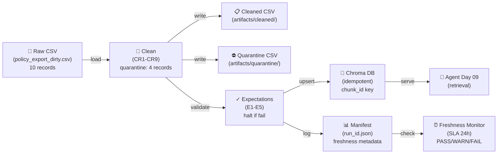

# Kiến trúc pipeline — Lab Day 10

**Nhóm:** E403-team-31
**Cập nhật:** 15/04/2026

---

## 1. Sơ đồ luồng (bắt buộc có 1 diagram: Mermaid / ASCII)

**Luồng:**
- **Raw ingest:** Load CSV từ `data/raw/policy_export_dirty.csv` (10 records mẫu)
- **Clean:** Áp dụng 9 rules (allowlist doc_id, normalize date, dedupe, check refund 7-day v.v.)
  - Quarantine: 4 records (stale HR, invalid date format, duplicate, suspicious pattern)
  - Pass: 6 records → cleaned CSV
- **Validate:** Run 5 expectations (E1-E5), **halt** nếu critical fail (refund stale 14d, empty doc_id, etc.)
- **Embed:** Upsert vào Chroma collection `day10_kb` dùng `chunk_id` stable (idempotent)
- **Monitor:** Lưu manifest với `run_id`, `raw/cleaned/quarantine counts`, `latest_exported_at`
- **Freshness check:** Compare manifest timestamp vs SLA 24h → PASS/WARN/FAIL

---

## 2. Ranh giới trách nhiệm

| Thành phần | Input | Output | Owner nhóm |
|------------|-------|--------|--------------|
| **Ingest** | Raw CSV (`data/raw/policy_export_dirty.csv`) | Row list dict, `raw_records` count | Ingestion Owner |
| **Transform** | Row list, schema contract | Cleaned rows + quarantine flags | Cleaning/Quality Owner |
| **Quality** | Cleaned rows | Expectation results (pass/halt), detailed reasons | Cleaning/Quality Owner |
| **Embed** | Cleaned CSV, expectations passed | Chroma upsert, `chunk_id` stable, prune old | Embed Owner |
| **Monitor** | Manifest JSON, SLA config | Freshness check (PASS/WARN/FAIL), alert message | Monitoring/Docs Owner |

---

## 3. Idempotency & rerun

**Strategy:** Upsert số $\text{upsert}$ vào Chroma dùng `chunk_id` làm khóa stable.

**Implementation:**
- `chunk_id = sha256(doc_id | chunk_text | seq)[:16]` → deterministic
- Mỗi lần embed chạy, Chroma **cập nhật (không insert duplicate)** nếu `chunk_id` đã tồn tại
- Sau publish, prune các `chunk_id` bị xóa từ nguồn (nếu row bị quarantine lần này nhưng embed lần trước)

**Test:** Rerun 2 lần với cùng CSV → kết quả identical, không append duplicate vector.

---

## 4. Liên hệ Day 09

**Share chung:** Cùng `data/docs/` (5 tài liệu: policy_refund_v4, sla_p1_2026, it_helpdesk_faq, hr_leave_policy, access_control_sop).

**Flow:**
1. Day 09 multi-agent chạy retrieval trên Chroma collection `day10_kb`
2. Day 10 pipeline update collection:
   - Thêm/cập nhật chunk từ cleaned CSV
   - Prune chunk từ stale version (vd policy_refund_v3 hoặc hr_leave_policy 2025)
   - Trigger rerun Day 09 test để kiểm tra retrieval chất lượng

**Validation:** Test 4 golden queries (`test_questions.json`) — nếu bất kỳ `contains_expected=no` hoặc `hits_forbidden=yes` → investigate pipeline quality.

---

## 5. Rủi ro đã biết

- **Stale data version mixin:** Nếu source export quên xóa policy_refund_v3 (14-day), embedding lỗi → agent trả "14 ngày" thay vì "7 ngày" ✓ *mitigated: E3 halt + quarantine v3*
- **Duplicate chunk_id từ format inconsistency:** Nếu CSV lần này có Unicode khác, hash khác → tạo chunk_id mới mà content giống → duplicate vector ✓ *mitigated: normalization CR3*
- **Freshness SLA 24h quá lông:** Nếu batch chạy late (hôm sau), freshness WARN/FAIL mặc dù data ổn ✓ *mitigated: runbook có escalation path*
- **Export future timestamp (clock skew):** Nếu source server sai giờ, `exported_at` > now ✓ *mitigated: CR8 quarantine invalid_exported_at*
