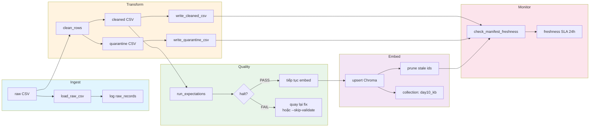

# Kiến trúc pipeline — Lab Day 10

**Nhóm:** E403-team-31
**Cập nhật:** 15/04/2026

---

## 1. Sơ đồ luồng (bắt buộc có 1 diagram: Mermaid / ASCII)



**run_id** được ghi vào manifest và metadata của mỗi vector (dùng để trace lineage và prune theo batch).

**Quarantine** nhận các bản ghi bị loại tại mỗi cleaning rule với lý do cụ thể:
- `unknown_doc_id`, `suspicious_doc_id_prefix`
- `invalid_exported_at`, `empty_effective_date`, `invalid_effective_date_format`
- `stale_hr_policy_effective_date`, `missing_chunk_text`, `chunk_text_too_short`
- `duplicate_chunk_text`

---

## 2. Ranh giới trách nhiệm

| Thành phần | Input | Output | Owner nhóm |
|------------|-------|--------|--------------|
| **Ingest** | `data/raw/policy_export_dirty.csv` | Dict rows, log `raw_records`, tạo `run_id` | Ingestion Owner |
| **Transform** (cleaning_rules.py) | Dict rows | `(cleaned, quarantine)` tuples → cleaned CSV + quarantine CSV | Cleaning Owner |
| **Quality** (expectations.py) | cleaned rows | `ExpectationResult[]` + halt flag, log từng expectation | Quality Owner |
| **Embed** (chroma utils) | cleaned CSV | upsert vector vào Chroma collection `day10_kb`, prune vector cũ | Embed Owner |
| **Monitor** (freshness_check.py) | manifest JSON | `PASS/WARN/FAIL` + `age_hours` vs SLA | Monitoring/Docs Owner |

**freshness** được đo tại điểm `publish` (sau khi embed thành công), dựa trên `latest_exported_at` trong manifest.

---

## 3. Idempotency & rerun

**Upsert theo `chunk_id`**: mỗi run tạo `chunk_id = {doc_id}_{seq}_{hash16}` — stable không đổi khi text không đổi. Chroma upsert sẽ cập nhật vector mà không tạo duplicate nếu cùng `chunk_id`.

**Prune sau publish**: sau upsert, pipeline lấy toàn bộ `ids` đang có trong collection, so sánh với `ids` của run hiện tại, xoá các id không còn trong cleaned (đảm bảo vector stale không còn trong top-k).

```
prev_ids = col.get(ids=[])
drop = sorted(prev_ids - set(current_ids))
col.delete(ids=drop)
```

→ **Rerun 2 lần không duplicate vector**, chỉ refresh nếu text thay đổi hoặc xoá nếu bị loại khỏi cleaned.

---

## 4. Liên hệ Day 09

Pipeline này cung cấp **corpus đã cleaned và embedded** vào Chroma collection `day10_kb`, phục vụ retrieval cho Day 09 agent.

- **Cùng nguồn**: canonical source documents ở `data/docs/` (policy_refund_v4.txt, sla_p1_2026.txt, it_helpdesk_faq.txt, hr_leave_policy.txt) — cùng content nhưng exported qua CSV dirty để simulate ingest thực tế.
- **Export riêng**: cleaned data được embed vào Chroma (không dùng lại vector từ Day 09) để đảm bảo freshness và clean hoàn toàn trước khi phục vụ agent.
- **run_id lineage**: manifest ghi `run_id` và `latest_exported_at` để Day 09 agent/biến có thể verify corpus version.

---

## 5. Rủi ro đã biết

- **Stale refund policy (14→7 ngày)**: baseline đã fix, expectation E3 fail nếu còn sót
- **HR leave policy version conflict (10 vs 12 ngày)**: HR policy trước 2026-01-01 bị quarantine; expectation E6 fail nếu còn 10 ngày phép năm
- **Chunk text ngắn**: CR9 quarantine nếu < 20 chars; E4/E5 kiểm tra post-clean
- **Future timestamp poisoning**: exported_at > 2030 hoặc < 2020 bị quarantine; E8 warn
- **Suspicious doc_id prefix** (legacy/test/beta/deprecated_): CR7 quarantine
- **Freshness SLA breach**: nếu `latest_exported_at` cũ hơn 24h, freshness_check trả FAIL và alert email
